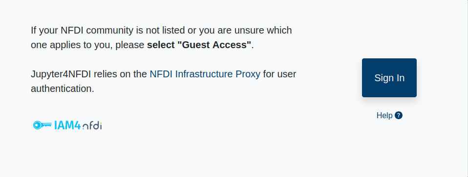
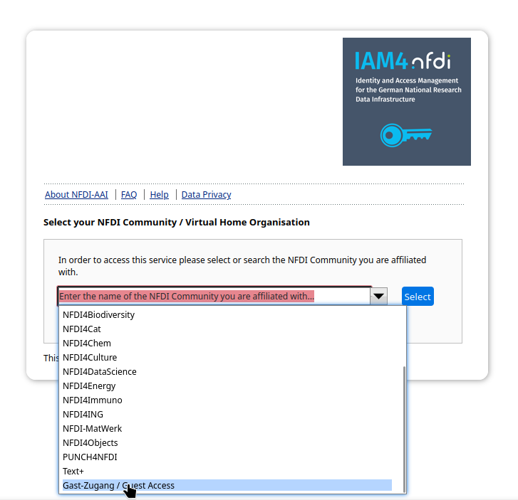
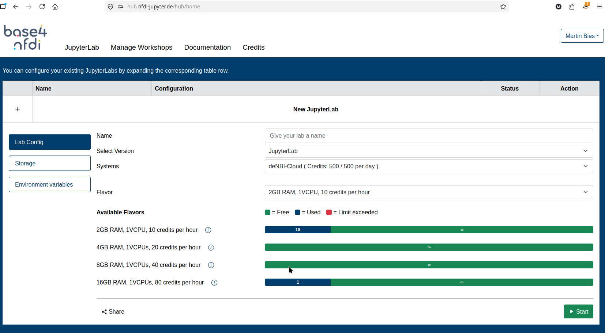
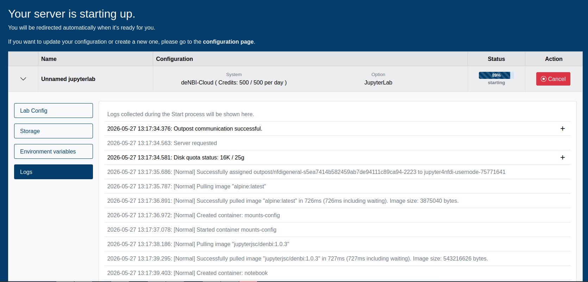

# Try OSCAR Online

OSCAR can be tried online without installation, on the NFDI Jupyter hub.

The NFDI Jupyter hub provides a fixed amount of credits per user per day (as of 27 May 2026 a total of 500 credits is provided). Trying out OSCAR requires a fixed amount of credits (as of 27 May 2026, 40 credits per hour). With these credits, you can try out OSCAR online free of cost.

Use the following steps:

1. Go to
   <https://hub.nfdi-jupyter.de/workshops/oscar-latest>,
   and log in using the "Sign In" button.
   {: width="50%" }

2. On the page that appears next, select "Gast Zugang/Guest Access" if no other choice applies to you.

   {: width="50%" }

3. Select your academic institution, or Google/Github/ORCID to identify yourself. Follow the
   authentication workflow of your chosen service (different for each service). It should be safe to
   allow permissions asked for along this workflow.

   If this is the first time you are logging in, there may be additional sign up steps.
   If at any point you get stuck, try starting over by visiting (not using the back button)
   <https://hub.nfdi-jupyter.de/workshops/oscar-latest>.
   {: width="50%" }

3. Eventually, you should see a message as below.

   {: width="50%" }

   Click on "Start" (bottom right) to start your Oscar server. This may take a few minutes.
   You will be automatically redirected to a Jupyter interface once the server is ready.

   {: width="50%" }

4. Select the option in the notebook section which says "Oscar".
   {: width="50%" }

   If you accidentally started the OSCAR entry in the "console" section (instead of the "notebook"
   section), or any other of the listed entries, don't worry: you can just close the jupyter tab to
   get back to the launcher page.

5. Try to execute a simple statement to check that the Julia kernel has started and is connected to
   the notebook, `println(4)`, for example. (This may take multiple minutes as the server finishes
   setting up things in the background.)

6. You can now use OSCAR as per normal instructions. Maybe try out the [Linear Algebra
   Tutorial](https://nbviewer.org/github/oscar-system/OSCARBinder/blob/master/LinearAlgebraInOSCAR.ipynb).
   Note that running `using Oscar` is a required step, but will not print the OSCAR banner. Run
   `Oscar.versioninfo()` to verify the version of OSCAR being used.

{: width="50%" }
